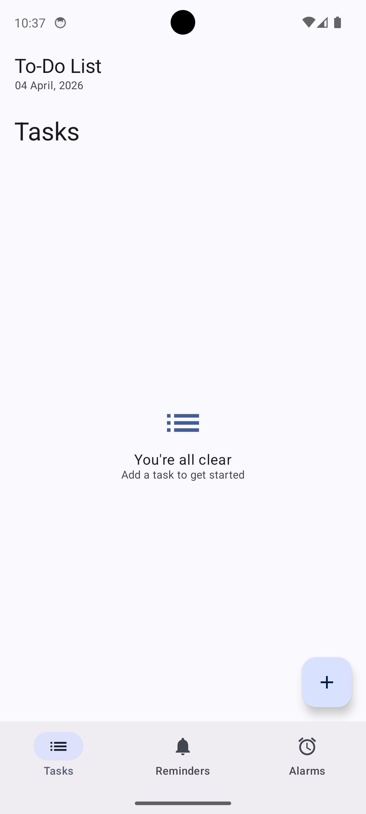
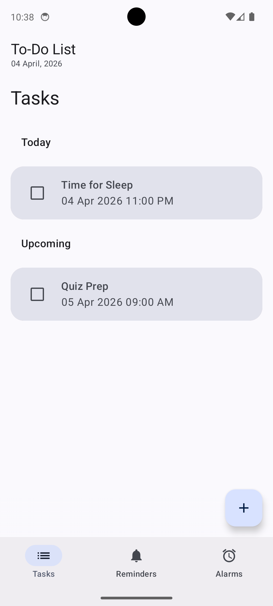
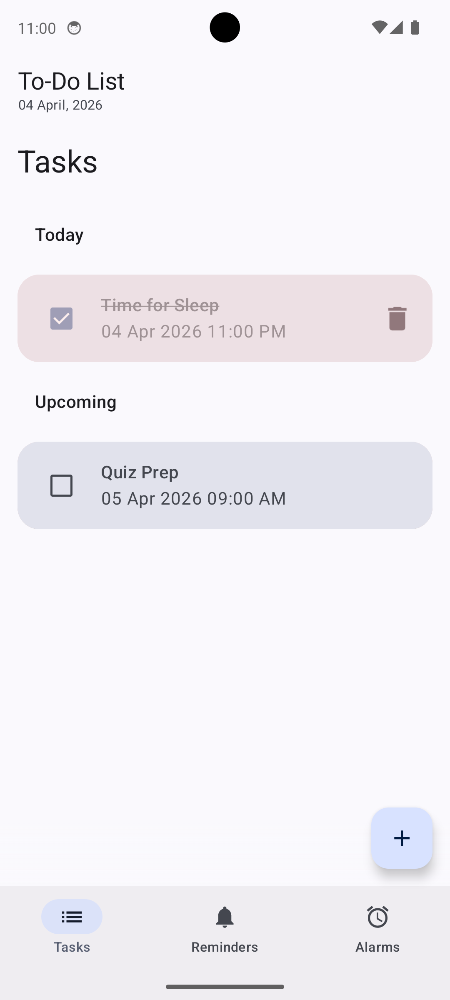
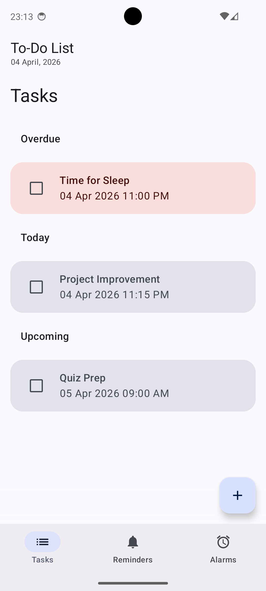

# ToDo List Android App

A modern Task Management Android App built using **Kotlin + Jetpack Compose.**
This app helps users organize tasks efficiently with smart categorization like **Today, Upcoming, and Overdue,** along with a redesigned UI for better usability.
This project was created as part of learning modern Android development.

## Features

* Add tasks to a to-do list
* Mark tasks as completed using a checkbox
* Delete tasks from the list
* Date & Time based task scheduling
* Modern UI built with Jetpack Compose

## Tech Stack

* **Kotlin**
* **Jetpack Compose**
* **Android Studio**
* **Gradle (KTS)**

## Project Structure

```
ToDoList/
│
├── app/                 # Main Android application module
├── gradle/              # Gradle wrapper files
├── build.gradle.kts     # Project build configuration
├── settings.gradle.kts
└── gradlew
```

## How to Run the Project

1. Clone the repository

```
git clone https://github.com/kunvarpreet15/ToDoListApp.git
```

2. Open the project in **Android Studio**

3. Let Gradle sync

4. Run the app on:

   * Android Emulator
   * Physical Android device

## Learning Goals

This project was built to practice:

* Jetpack Compose UI
* State management in Compose
* Basic Android project structure

## Screenshots

<p align="center">
  
  
  
  
</p>
## Key Improvements (Recent Updates)
* Switched to a cleaner, more structured layout
* Improved readability and task hierarchy
* Better spacing, typography, and visual clarity

## Future Improvements

* Task persistence using Room database
* Edit existing tasks
* Task categories
* Notifications & reminders

## License

This project is open source and available under the MIT License.
